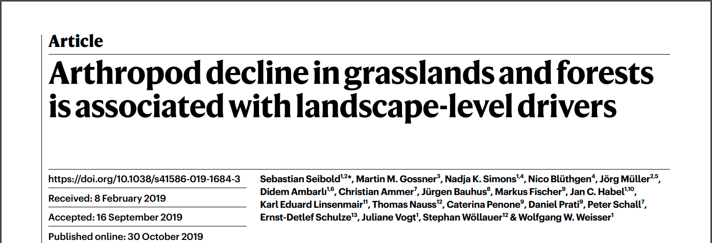
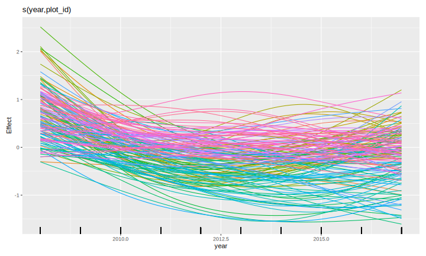

```{r setup, include=FALSE, cache=FALSE}
options(htmltools.dir.version = FALSE)
knitr::opts_chunk$set(cache = TRUE, dev = 'svg', echo = TRUE, message = FALSE, warning = FALSE,
                      fig.height=6, fig.width = 1.777777*6)

library("curl")
library('here')
library('mgcv')
library('gratia')
library('ggplot2')
library('purrr')
library('mvnfast')
library("tibble")
library('gganimate')
library('tidyr')
library("knitr")
library("viridis")
library('readr')
library('dplyr')
library('gganimate')

## plot defaults
theme_set(theme_minimal(base_size = 16, base_family = 'Fira Sans'))

## constants
anim_width <- 1000
anim_height <- anim_width / 1.77777777
anim_dev <- 'png'
anim_res <- 200
```

# Biodiversity losses

.center[
]

???

Many of us will be familiar with trends like this

Global biodiversity is in trouble

Whereever we look we see declining populations

Living Plant Index is an average measure of change (so some time series in a region could be increasing even if overall we have a decline in LPI)

---

# Biodiversity losses..?

.center[
]

Vellend *et al* (2013) *PNAS*

.center[
]

Dornelas *et al* 2014 *Science*

???

But studies showing declining biodiversity are not without issue

There has been a decade or more long discussion about the extent to which diversity is declining

A lot of the 

---

# Biodiversity losses..?

.center[
]

Gonzalez *et al* (2016) *Ecology*

.center[
]

Vellend *et al* 2017 *Ecology*

---

# Biodiversity gains & losses

.center[
]

Dornelas *et al* (2019) *Ecology Letters*

In part disagreement relates to *population* versus *assemblage* level metrics

Partly due to how the data are analysed

---
class: inverse middle center subsection

# Arthropod diversity

---

# Linear trends

Majority of these large-scale syntheses use linear trend models

.center[
]

Fig 2 from Dornelas *et al* (2014) *Science*

($y_i$ sometimes transformed)

---

# Seibold et al 2019

Analysed 150 grassland and 140 forest sites across 3 regions of Gernmany 2008&ndash;2017

.center[
]

Seibold *et al* (2019) *Nature*

---

# Declining arthopod biomass, abundance, and richness

.center[
]

Seibold *et al* (2019) *Nature*

---

# Declining arthopod biomass, abundance, and richness

* Grasslands

    * Biomass &#8595; 67%

    * Abundance &#8595; 78%

    * Richness &#8595; 36%

* Forests (30 site subset)

    * Biomass &#8595; 41%

    * Richness &#8595; 36%

---

# Good and bad years

.center[

]

Fournier *et al* (2019) *Conservation Biology* [doi: 10.1111/cobi.13371](https://doi.org/10.1111/cobi.13371)

---

# Good and bad years

Daskalova *et al* (2021) attempted to account for this effect using random effects of `Year`

.center[

]

Daskalova *et al* (2021) *Insect Conservation & Diversity*

---
class: inverse middle center subsection

# GAMs

---

# HadCRUT4 time series

```{r hadcrut-temp-example, echo = FALSE}
library('readr')
library('dplyr')
## Load Data
tmpf <- tempfile()
curl_download("https://www.metoffice.gov.uk/hadobs/hadcrut4/data/current/time_series/HadCRUT.4.6.0.0.annual_nh.txt", tmpf)
gtemp <- read.table(tmpf, colClasses = rep("numeric", 12))[, 1:2] # only want some of the variables
names(gtemp) <- c("Year", "Temperature")
gtemp <- as_tibble(gtemp)

## Plot
gtemp_plt <- ggplot(gtemp, aes(x = Year, y = Temperature)) +
    geom_line() + 
    geom_point() +
    labs(x = 'Year', y = expression(Temeprature ~ degree*C))
gtemp_plt
```

???

Hadley Centre NH temperature record ensemble

How would you model the trend in these data?

---

# Linear Models

$$y_i \sim \mathcal{N}(\mu_i, \sigma^2)$$

$$\mu_i = \beta_0 + \beta_1 \mathtt{year}_{i} + \beta_2 \mathtt{year}^2_{1i} + \cdots + \beta_j \mathtt{year}^j_{i}$$

---

# Polynomials perhaps&hellip;

```{r hadcrut-temp-polynomial, echo = FALSE}
p <- c(1,3,8,15)
N <- 300
newd <- with(gtemp, data.frame(Year = seq(min(Year), max(Year), length = N)))
polyFun <- function(i, data = data) {
    lm(Temperature ~ poly(Year, degree = i), data = data)
}
mods <- lapply(p, polyFun, data = gtemp)
pred <- vapply(mods, predict, numeric(N), newdata = newd)
colnames(pred) <- p
newd <- cbind(newd, pred)
polyDat <- gather(newd, Degree, Fitted, - Year)
polyDat <- mutate(polyDat, Degree = ordered(Degree, levels = p))
gtemp_plt + geom_line(data = polyDat, mapping = aes(x = Year, y = Fitted, colour = Degree),
                      size = 1.5, alpha = 0.9) +
    scale_color_brewer(name = "Degree", palette = "PuOr") +
    theme(legend.position = "right")
```

---

# Polynomials perhaps&hellip;

We can keep on adding ever more powers of $\boldsymbol{x}$ to the model &mdash;
model selection problem

**Runge phenomenon** &mdash; oscillations at the edges of an interval &mdash;
means simply moving to higher-order polynomials doesn't always improve accuracy

---
class: inverse middle center subsection

# GAMs offer a solution

---

# Generalized Additive Models

<br />


.references[Source: [GAMs in R by Noam Ross](https://noamross.github.io/gams-in-r-course/)]

???

GAMs are an intermediate-complexity model

* can learn from data without needing to be informed by the user
* remain interpretable because we can visualize the fitted features

---

# How is a GAM different?

$$\begin{align*}
y_i &\sim \mathcal{D}(\mu_i, \theta) \\ 
\mathbb{E}(y_i) &= \mu_i = g(\eta_i)^{-1}
\end{align*}$$

We model the mean of data as a sum of linear terms:

$$\eta_i = \beta_0 +\sum_j \color{red}{ \beta_j x_{ji}} +\epsilon_i$$

A GAM is a sum of _smooth functions_ or _smooths_

$$\eta_i = \beta_0 + \sum_j \color{red}{f_j(x_{ji})} + \epsilon_i$$

---

# Fitting a GAM in R

```r
model <- gam(y ~ s(x1) + s(x2) + te(x3, x4), # formuala describing model
             data = my_data_frame,           # your data
             method = 'REML',                # or 'ML'
             family = gaussian)              # or something more exotic
```

`s()` terms are smooths of one or more variables

`te()` terms are the smooth equivalent of *main effects + interactions*

$$\eta_i = \beta_0 + f(\mathtt{Year}_i)$$

```r
library(mgcv)
gam(Temperature ~ s(Year, k = 10), data = gtemp, method = 'REML')
```

---

# Fitted GAM

```{r hadcrtemp-plot-gam, echo = FALSE}
library('mgcv')
m <- gam(Temperature ~ s(Year), data = gtemp, method = 'REML')
N <- 300
newd <- as_tibble(with(gtemp, data.frame(Year = seq(min(Year), max(Year),
                                                    length = N))))
pred <- as_tibble(as.data.frame(predict(m, newdata = newd, se.fit = TRUE,
                                        unconditional = TRUE)))
pred <- bind_cols(newd, pred) %>%
    mutate(upr = fit + 2 * se.fit, lwr = fit - 2*se.fit)

ggplot(gtemp, aes(x = Year, y = Temperature)) +
    geom_point() +
    geom_ribbon(data = pred,
                mapping = aes(ymin = lwr, ymax = upr, x = Year), alpha = 0.4,
                inherit.aes = FALSE,
                fill = "steelblue") +
    geom_line(data = pred,
              mapping = aes(y = fit, x = Year),
              inherit.aes = FALSE, size = 1,
              colour = "steelblue") +
    labs(x = 'Year', y = expression(Temeprature ~ degree*C))
```
---
class: inverse
background-image: url('./resources/rob-potter-398564.jpg')
background-size: contain

# What magic is this?

.footnote[
<a style="background-color:black;color:white;text-decoration:none;padding:4px 6px;font-family:-apple-system, BlinkMacSystemFont, &quot;San Francisco&quot;, &quot;Helvetica Neue&quot;, Helvetica, Ubuntu, Roboto, Noto, &quot;Segoe UI&quot;, Arial, sans-serif;font-size:12px;font-weight:bold;line-height:1.2;display:inline-block;border-radius:3px;" href="https://unsplash.com/@robpotter?utm_medium=referral&amp;utm_campaign=photographer-credit&amp;utm_content=creditBadge" target="_blank" rel="noopener noreferrer" title="Download free do whatever you want high-resolution photos from Rob Potter"><span style="display:inline-block;padding:2px 3px;"><svg xmlns="http://www.w3.org/2000/svg" style="height:12px;width:auto;position:relative;vertical-align:middle;top:-1px;fill:white;" viewBox="0 0 32 32"><title></title><path d="M20.8 18.1c0 2.7-2.2 4.8-4.8 4.8s-4.8-2.1-4.8-4.8c0-2.7 2.2-4.8 4.8-4.8 2.7.1 4.8 2.2 4.8 4.8zm11.2-7.4v14.9c0 2.3-1.9 4.3-4.3 4.3h-23.4c-2.4 0-4.3-1.9-4.3-4.3v-15c0-2.3 1.9-4.3 4.3-4.3h3.7l.8-2.3c.4-1.1 1.7-2 2.9-2h8.6c1.2 0 2.5.9 2.9 2l.8 2.4h3.7c2.4 0 4.3 1.9 4.3 4.3zm-8.6 7.5c0-4.1-3.3-7.5-7.5-7.5-4.1 0-7.5 3.4-7.5 7.5s3.3 7.5 7.5 7.5c4.2-.1 7.5-3.4 7.5-7.5z"></path></svg></span><span style="display:inline-block;padding:2px 3px;">Rob Potter</span></a>
]

---

# How did `gam()` *know* what line to fit?

```{r hadcrtemp-plot-gam, echo = FALSE}
```

---
class: inverse
background-image: url('resources/wiggly-things.png')
background-size: contain

???

---

```{r smooth-fun-animation, results = FALSE, echo = FALSE}
f <- function(x) {
    x^11 * (10 * (1 - x))^6 + ((10 * (10 * x)^3) * (1 - x)^10)
}

draw_beta <- function(n, k, mu = 1, sigma = 1) {
    rmvn(n = n, mu = rep(mu, k), sigma = diag(rep(sigma, k)))
}

weight_basis <- function(bf, x, n = 1, k, ...) {
    beta <- draw_beta(n = n, k = k, ...)
    out <- sweep(bf, 2L, beta, '*')
    colnames(out) <- paste0('f', seq_along(beta))
    out <- as_tibble(out)
    out <- add_column(out, x = x)
    out <- pivot_longer(out, -x, names_to = 'bf', values_to = 'y')
    out
}

random_bases <- function(bf, x, draws = 10, k, ...) {
    out <- rerun(draws, weight_basis(bf, x = x, k = k, ...))
    out <- bind_rows(out)
    out <- add_column(out, draw = rep(seq_len(draws), each = length(x) * k),
                      .before = 1L)
    class(out) <- c("random_bases", class(out))
    out
}

plot.random_bases <- function(x, facet = FALSE) {
    plt <- ggplot(x, aes(x = x, y = y, colour = bf)) +
        geom_line(lwd = 1, alpha = 0.75) +
        guides(colour = "none")
    if (facet) {
        plt + facet_wrap(~ draw)
    }
    plt
}

normalize <- function(x) {
    rx <- range(x)
    z <- (x - rx[1]) / (rx[2] - rx[1])
    z
}

set.seed(1)
N <- 500
data <- tibble(x     = runif(N),
               ytrue = f(x),
               ycent = ytrue - mean(ytrue),
               yobs  = ycent + rnorm(N, sd = 0.5))

k <- 10
knots <- with(data, list(x = seq(min(x), max(x), length = k)))
sm <- smoothCon(s(x, k = k, bs = "cr"), data = data, knots = knots)[[1]]$X
colnames(sm) <- levs <- paste0("f", seq_len(k))
basis <- pivot_longer(cbind(sm, data), -(x:yobs), names_to = 'bf')
basis

set.seed(2)
bfuns <- random_bases(sm, data$x, draws = 20, k = k)

smooth <- bfuns %>%
    group_by(draw, x) %>%
    summarise(spline = sum(y)) %>%
    ungroup()

p1 <- ggplot(smooth) +
    geom_line(data = smooth, aes(x = x, y = spline), lwd = 1.5) +
    labs(y = 'f(x)', x = 'x') +
    theme_minimal(base_size = 16, base_family = 'Fira Sans')

smooth_funs <- animate(
    p1 + transition_states(draw, transition_length = 4, state_length = 2) + 
    ease_aes('cubic-in-out'),
    nframes = 200, height = anim_height, width = anim_width, res = anim_res,
    dev = anim_dev)

anim_save('resources/spline-anim.gif', smooth_funs)
```

# Wiggly things

.center[]

???

GAMs use splines to represent the non-linear relationships between covariates,
here `x`, and the response variable on the `y` axis.

---

# Basis expansions

In the polynomial models we used a polynomial basis expansion of $\boldsymbol{x}$

* $\boldsymbol{x}^0 = \boldsymbol{1}$ &mdash; the model constant term
* $\boldsymbol{x}^1 = \boldsymbol{x}$ &mdash; linear term
* $\boldsymbol{x}^2$
* $\boldsymbol{x}^3$
* &hellip;

---

# Splines

Splines are *functions* composed of simpler functions

Simpler functions are *basis functions* & the set of basis functions is a *basis*

When we model using splines, each basis function $b_k$ has a coefficient $\beta_k$

Resultant spline is a the sum of these weighted basis functions, evaluated at the values of $x$

$$s(x) = \sum_{k = 1}^K \beta_k b_k(x)$$

---

# Splines formed from basis functions

```{r basis-functions, fig.height=6, fig.width = 1.777777*6, echo = FALSE}
ggplot(basis,
       aes(x = x, y = value, colour = bf)) +
    geom_line(lwd = 2, alpha = 0.5) +
    guides(colour = "none") +
    labs(x = 'x', y = 'b(x)') +
    theme_minimal(base_size = 20, base_family = 'Fira Sans')
```

???

Splines are built up from basis functions

Here I'm showing a cubic regression spline basis with 10 knots/functions

We weight each basis function to get a spline. Here all the basisi functions have the same weight so they would fit a horizontal line

---

# Weight basis functions &#8680; spline

```{r basis-function-animation, results = 'hide', echo = FALSE}
bfun_plt <- plot(bfuns) +
    geom_line(data = smooth, aes(x = x, y = spline),
              inherit.aes = FALSE, lwd = 1.5) +
    labs(x = 'x', y = 'f(x)') +
    theme_minimal(base_size = 14, base_family = 'Fira Sans')

bfun_anim <- animate(
    bfun_plt + transition_states(draw, transition_length = 4, state_length = 2) + 
    ease_aes('cubic-in-out'),
    nframes = 200, height = anim_height, width = anim_width, res = anim_res, dev = anim_dev)

anim_save('resources/basis-fun-anim.gif', bfun_anim)
```

.center[]

???

But if we choose different weights we get more wiggly spline

Each of the splines I showed you earlier are all generated from the same basis functions but using different weights

---

# How do GAMs learn from data?

```{r example-data-figure, fig.height=6, fig.width = 1.777777*6, echo = FALSE}
data_plt <- ggplot(data, aes(x = x, y = ycent)) +
    geom_line(col = 'goldenrod', lwd = 2) +
    geom_point(aes(y = yobs), alpha = 0.2, size = 3) +
    labs(x = 'x', y = 'f(x)') +
    theme_minimal(base_size = 20, base_family = 'Fira Sans')
data_plt
```

???

How does this help us learn from data?

Here I'm showing a simulated data set, where the data are drawn from the orange functions, with noise. We want to learn the orange function from the data

---

# Maximise penalised log-likelihood &#8680; &beta;

```{r basis-functions-anim, results = "hide", echo = FALSE}
sm2 <- smoothCon(s(x, k = k, bs = "cr"), data = data, knots = knots)[[1]]$X
beta <- coef(lm(ycent ~ sm2 - 1, data = data))
wtbasis <- sweep(sm2, 2L, beta, FUN = "*")
colnames(wtbasis) <- colnames(sm2) <- paste0("F", seq_len(k))
## create stacked unweighted and weighted basis
basis <- as_tibble(rbind(sm2, wtbasis)) %>%
    add_column(x = rep(data$x, times = 2),
               type = rep(c('unweighted', 'weighted'), each = nrow(sm2)),
               .before = 1L)
##data <- cbind(data, fitted = rowSums(scbasis))
wtbasis <- as_tibble(rbind(sm2, wtbasis)) %>%
    add_column(x      = rep(data$x, times = 2),
               fitted = rowSums(.),
               type   = rep(c('unweighted', 'weighted'), each = nrow(sm2))) %>%
    pivot_longer(-(x:type), names_to = 'bf')
basis <- pivot_longer(basis, -(x:type), names_to = 'bf')

p3 <- ggplot(data, aes(x = x, y = ycent)) +
    geom_point(aes(y = yobs), alpha = 0.2) +
    geom_line(data = basis,
              mapping = aes(x = x, y = value, colour = bf),
              lwd = 1, alpha = 0.5) +
    geom_line(data = wtbasis,
              mapping = aes(x = x, y = fitted), lwd = 1, colour = 'black', alpha = 0.75) +
    guides(colour = "none") +
    labs(y = 'f(x)', x = 'x') +
    theme_minimal(base_size = 16, base_family = 'Fira Sans')

crs_fit <- animate(p3 + transition_states(type, transition_length = 4, state_length = 2) + 
                   ease_aes('cubic-in-out'),
                   nframes = 100, height = anim_height, width = anim_width, res = anim_res,
                   dev = anim_dev)

anim_save('./resources/gam-crs-animation.gif', crs_fit)
```

.center[]

???

Fitting a GAM involves finding the weights for the basis functions that produce a spline that fits the data best, subject to some constraints


---
class: inverse middle center subsection

# Avoid overfitting our sample

---
class: inverse center middle large-subsection

# How wiggly?

$$
\int_{\mathbb{R}} [f^{\prime\prime}]^2 dx = \boldsymbol{\beta}^{\mathsf{T}}\mathbf{S}\boldsymbol{\beta}
$$

---
class: inverse center middle large-subsection

# Penalised fit

$$
\mathcal{L}_p(\boldsymbol{\beta}) = \mathcal{L}(\boldsymbol{\beta}) - \frac{1}{2} \lambda\boldsymbol{\beta}^{\mathsf{T}}\mathbf{S}\boldsymbol{\beta}
$$

---

# Wiggliness

$$\int_{\mathbb{R}} [f^{\prime\prime}]^2 dx = \boldsymbol{\beta}^{\mathsf{T}}\mathbf{S}\boldsymbol{\beta} = \large{W}$$

(Wiggliness is the correct word and I'll die on that hill Reviewer 2)

We penalize wiggliness to avoid overfitting

---

# Making wiggliness matter

$W$ measures **wiggliness**

(log) likelihood measures closeness to the data

We use a **smoothing parameter** $\lambda$ to define the trade-off, to find
the spline coefficients $B_k$ that maximize the **penalized** log-likelihood

$$\mathcal{L}_p = \log(\text{Likelihood})  - \lambda W$$

---

# HadCRUT4 time series

```{r hadcrut-temp-penalty, echo = FALSE}
K <- 40
lambda <- c(10000, 1, 0.01, 0.00001)
N <- 300
newd <- with(gtemp, data.frame(Year = seq(min(Year), max(Year), length = N)))
fits <- lapply(lambda, function(lambda) gam(Temperature ~ s(Year, k = K, sp = lambda), data = gtemp))
pred <- vapply(fits, predict, numeric(N), newdata = newd)
op <- options(scipen = 100)
colnames(pred) <- lambda
newd <- cbind(newd, pred)
lambdaDat <- gather(newd, Lambda, Fitted, - Year)
lambdaDat <- transform(lambdaDat, Lambda = factor(paste("lambda ==", as.character(Lambda)),
                                                  levels = paste("lambda ==", as.character(lambda))))

gtemp_plt + geom_line(data = lambdaDat, mapping = aes(x = Year, y = Fitted, group = Lambda),
                      size = 1, colour = "#e66101") +
    facet_wrap( ~ Lambda, ncol = 2, labeller = label_parsed)
options(op)
```

---

# Picking the right wiggliness

.pull-left[
2 ways to think about how to optimize $\lambda$:

* Predictive: Minimize out-of-sample error
* Bayesian:  Put priors on our basis coefficients
]

.pull-right[
* **Practically**: use **REML**, because of numerical stability
* (Figure modified from Wood, 2011, J. R. Stat. Soc. B)
]

.center[

]

---

# Maximum allowed wiggliness

We set **basis complexity** or "size" $k$

This is _maximum wigglyness_, can be thought of as number of small functions that make up a curve

Once smoothing is applied, curves have fewer **effective degrees of freedom (EDF)**

EDF < $k$

---

# Maximum allowed wiggliness

$k$ must be *large enough*, the $\lambda$ penalty does the rest

*Large enough* &mdash; space of functions representable by the basis includes the true function or a close approximation to the tru function

Bigger $k$ increases computational cost

In **mgcv**, default $k$ values are arbitrary &mdash; after choosing the model terms, this is the key user choice

**Must be checked!** &mdash; `gam.check()`


---

# GAM summary

1. GAMs give us a framework to model flexible nonlinear relationships

2. Use little functions (**basis functions**) to make big functions (**smooths**)

3. Use a **penalty** to trade off wiggliness/generality 

4. Need to make sure your smooths are **wiggly enough**

---
class: inverse middle center subsection

# GAM meets Arthropods

---

# Athropod abundance

.center[
]

---

# Athropod abundance

Negative binomial GAM fitted to single site (AEG1)

.center[
]

---

# Grassland arthropod abundance

As an example

* Abundance of all identified Arthropods

* Grassland sites only

* Models

    * Linear global and site-specifi trends
    * Smooth trend of `year` plus `site` random intercepts
    * Regional smooths of `year` plus `site` random intercepts
    * Regional smooths of `year`, `site` specific *random* smooths
    * Regional smooths of `year`, year-to-year effects, `site` specific *random* smooths

---

# Random smooths?

* Random intercepts
* Random slopes
* Random smooths?

Random smooths yield a separate smooth for each subject

No un-penalized null space (intercept & linear components)

Can be shrunk to 0

Share a wiggliness penalty (plus $\lambda$ for intercepts & slopes)

---

# Random smooth model

`site` specific *random* smooths

.center[
]

---

# Model A

Regional smooths of `year`, `site` specific *random* smooths

.center[
]

---

# Model B

Regional smooths of `year`, year-to-year effects, `site` specific *random* smooths

.center[
]

---

# Results

* Model A (without Y2Y effects): AIC 15122 (255.7 EDF)
* Model B (with Y2Y effects): AIC 15123 (254.2 EDF)
* Equivalent mixed linear trend model (with Y2Y effects): AIC 15468 (111.8 EDF)

Use year-to-year effects or not?

--

(For these data) **A** and **B** are different ways to decompose the temporal effects

* Without Y2Y &#8594;	wigglier regional smooths
* With Y2Y &#8594; less wiggly regional smooths

???

Even with relatively simple data, GAMs yield much better fit than linear equiv.

---

# Penalty matrices

$$\boldsymbol{\beta}^{\mathsf{T}}\mathbf{S}\boldsymbol{\beta}$$

$\mathbf{S}$ is (are) the penalty matrices for the smooths

Smooths and random effects are two sides of the same coin

Random effect as a smooth has an identity matrix for $\mathbf{S}$

This isn't efficient but allows lots of models to be fitted in one software {mgcv}

Can use the MRF smooth to encode richer kinds of "smooths" (AR(p))

Can move to more efficient settings if needed

---

# Representing trends

With the penalty idea we can imagine several ways to account for temporal effects in GAMs

1. Fixed year effects
2. Random year effects
3. MRF equivalent of AR
4. Smooth
5. Linear

1 & 5 typically not penalized (but could be via `paraPen`)

Could combine these hierarchically

---

# Rates of change?

In linear models, the slopes (fixed or random) immediately give an estimate of the rate of change

--

What about smooths?

--

We can evaluate the derivative of the smooth at specific time points...

--

...which is more effort but nature isn't so kind as to be simple

---

# Nothing new under the sun

Nothing that new here

Fewster, Buckland, *et al* (2000) *Ecology*

(except Simon Wood's excellent {mgcv} software & ability to fit random smooths)

---

# Conclusions

Very much work in progress... but...

How we model trends in biodiversity data can change our view of losses and gains

Using "smooth" trends gives much better fit for the arthropod data here

Y2Y effects and / or smooth trends represent different decompositions of the *temporal* effect

However, interpretting and visualizing the results of GAM fits is more challenging

---

# Slides

* HTML Slide deck [bit.ly/ncse-2022]() &copy; Simpson (2022) [](http://creativecommons.org/licenses/by/4.0/)
* RMarkdown [bit.ly/ncse-2022-git](https://bit.ly/ncse-2022-git)

